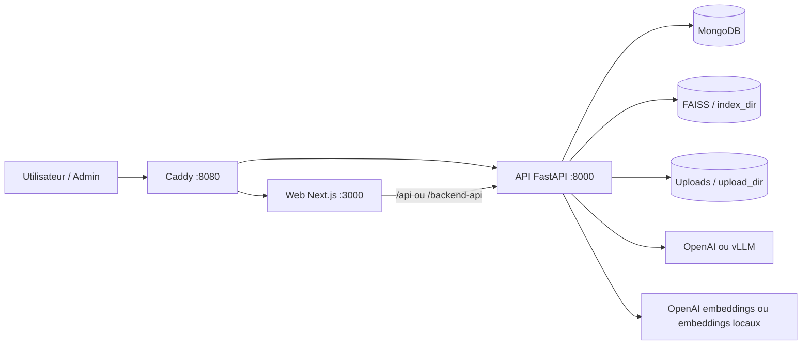
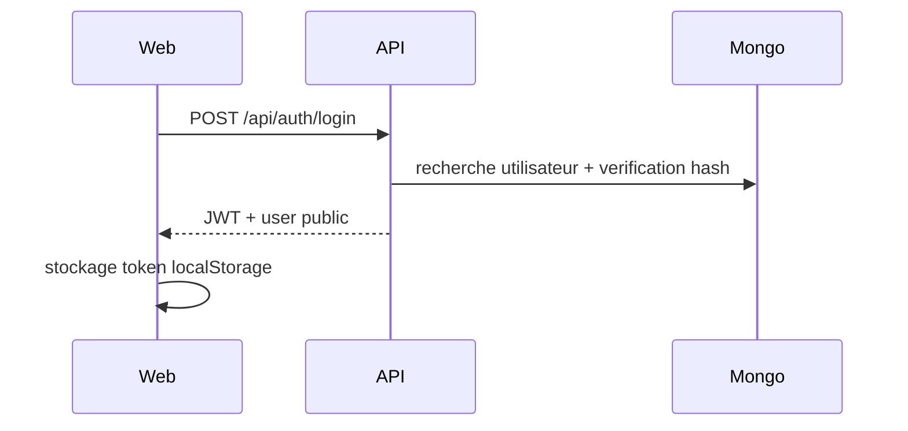
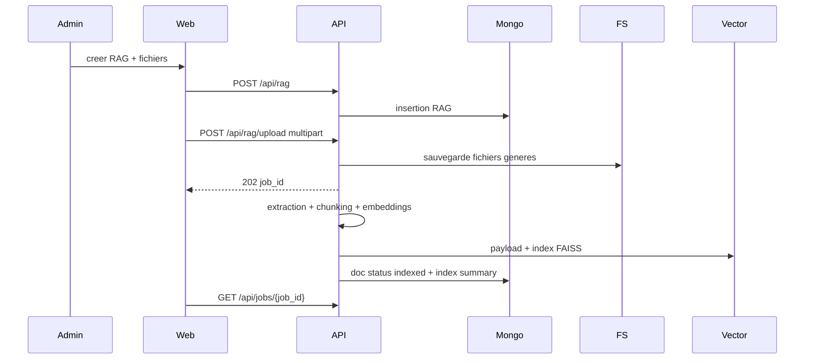
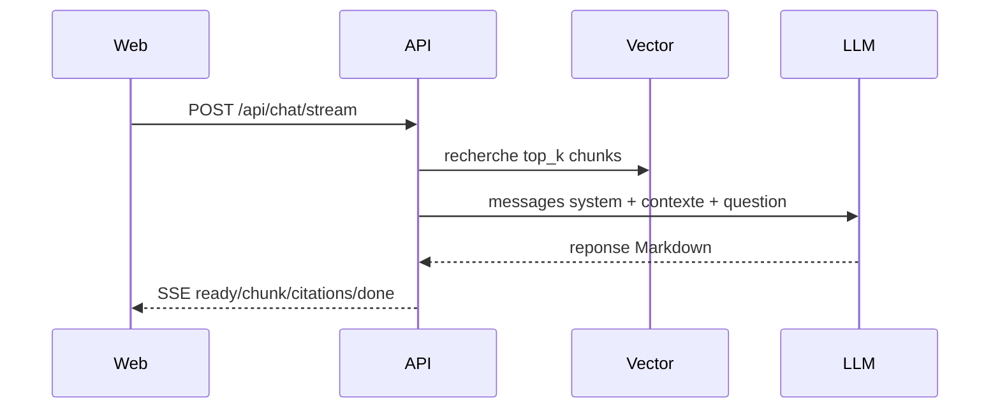

# 02 - Architecture applicative et technique

## Diagramme de haut niveau

## Composants

### Backend API

Chemin source: `backend/` dans le workspace, depot public `ChatFleetOSS/chatfleet-api`.

Technologies:

- Python 3.12;
- FastAPI;
- Motor / MongoDB;
- FAISS pour l'index vectoriel;
- PyPDF2, pdfplumber, python-docx, odfpy, chardet;
- OpenAI SDK compatible OpenAI/vLLM;
- SentenceTransformers pour embeddings locaux.

Responsabilites:

- authentification et autorisation;
- gestion utilisateurs;
- gestion RAG;
- ingestion documentaire;
- extraction texte, chunking, embeddings, index FAISS;
- chat synchrone et streaming SSE;
- configuration runtime des LLM et embeddings;
- healthcheck et build metadata.

### Frontend Web

Chemin source: `frontend/chatFleet_frontend/`, depot public `ChatFleetOSS/chatfleet-web`.

Technologies:

- Next.js 15;
- React 19;
- TypeScript;
- Zod pour validation runtime des reponses API;
- TanStack Query;
- composants UI internes et Radix;
- assistant-ui pour les surfaces de chat.

Responsabilites:

- login/register;
- tableau de bord RAG;
- admin settings LLM;
- creation et gestion des RAG;
- upload documents;
- edition du prompt systeme RAG;
- chat authentifie et public;
- rendu Markdown avec citations.

### Infra

Chemin source: `chatfleet-infra/`, depot public `ChatFleetOSS/chatfleet-infra`.

Technologies:

- Docker Compose;
- Caddy;
- MongoDB 6;
- scripts Bash/Python;
- GitHub Actions pour validation infra.

Responsabilites:

- installateur `install.sh`;
- mise a jour `upgrade.sh`;
- desinstallation `uninstall.sh`;
- resolution de channel `stable` ou `edge`;
- verification des versions live;
- orchestration Mongo/API/Web/Caddy.

## Flux de donnees principaux

### Connexion utilisateur

Le token est envoye ensuite en `Authorization: Bearer <jwt>`.

### Creation et ingestion RAG

### Chat RAG

## Boundaries et donnees persistantes

| Donnee | Stockage | Persistance |
| --- | --- | --- |
| Utilisateurs | MongoDB collection `users` | Volume Docker `mongo_data` |
| RAG metadata | MongoDB collection `rags` | Volume Docker `mongo_data` |
| Config LLM runtime | MongoDB collection `admin_settings` | Volume Docker `mongo_data` |
| Logs systeme applicatifs | MongoDB collection selon service logging | Volume Docker `mongo_data` |
| Fichiers uploades | `UPLOAD_DIR` | Volume Docker `chatfleet_uploads` |
| Payload chunks et index FAISS | `INDEX_DIR` | Volume Docker `chatfleet_index` |

## Ports

| Contexte | Service | Port |
| --- | --- | --- |
| Production Compose | Caddy public | `8080` |
| Compose interne | API | `8000` |
| Compose interne | Web | `3000` |
| Dev host | API | `8000` |
| Dev host | Web | `3000` |
| Dev host | Mongo | `27017` |

